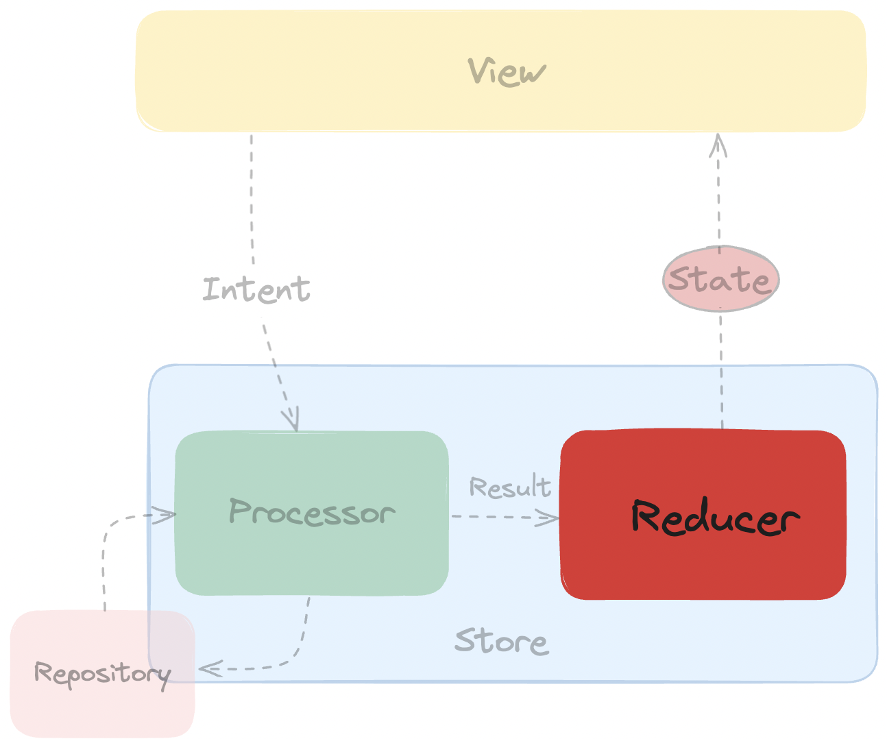

# Демонстрационный пример работы MVI

- В данном примере используется собственная реализация MVI (см. ru.androidschool.mvi.MainActivity )
- В RoxyMainActivity используется библиотека [Roxy](https://github.com/ww-tech/roxie)

### State — состояние системы, которое описывают текущее состояние приложения.


```kotlin
data class FeedViewState(
    val isLoading: Boolean,
    val articles: List<FeedArticle>,
    val favorites: List<FeedArticle>,
    val error: Throwable?
) {
    companion object {
        // Initial state
        val initial = FeedViewState(
            isLoading = false,
            articles = emptyList(),
            favorites = emptyList(),
            error = null
        )
    }
}
```

### View — отрисовывает State. Показать данные/лоадер/состояние ошибки etc.


```kotlin
class MainActivity : AppCompatActivity() {

    private val feedViewModel: FeedViewModel by viewModels()

    private lateinit var swipeRefreshLayout: SwipeRefreshLayout

    private fun intents(): Flow<FeedIntent> = merge(
        initialIntent(),
        refreshIntent()
    )

    private fun initialIntent(): Flow<FeedIntent> = flowOf(FeedIntent.Initial)

    private fun refreshIntent(): Flow<FeedIntent> = callbackFlow {
        swipeRefreshLayout.setOnRefreshListener {
            trySend(FeedIntent.Refresh())
        }

        awaitClose()
    }

    override fun onCreate(savedInstanceState: Bundle?) {
        super.onCreate(savedInstanceState)
        setContentView(R.layout.activity_main)
        swipeRefreshLayout = findViewById(R.id.swipeRefreshLayout)

        lifecycleScope.launch {
            lifecycle.repeatOnLifecycle(Lifecycle.State.STARTED) {
                intents().collect(feedViewModel::processIntent)
            }
        }

        lifecycleScope.launch {
            lifecycle.repeatOnLifecycle(Lifecycle.State.STARTED) {
                feedViewModel.viewStates().collect(::render)
            }
        }
    }

    private fun render(state: FeedViewState) {
        swipeRefreshLayout.isRefreshing = state.isLoading
    }
}

```

### Intent (Action) - события в системе (клик/свайп). Помогают из UI сообщить о произошедших изменений и уведомить об этом модель.


```kotlin
sealed class FeedIntent {

    data object Initial : FeedIntent() // When user just opens the screen.

    class Refresh : FeedIntent()

    class AddToFavorite(val article: FeedArticle) : FeedIntent()

    class RemoveFromFavorite(val article: FeedArticle) : FeedIntent()

    class Open(val article: FeedArticle) : FeedIntent()
}
```

### Processor — обрабатывает Intent


```kotlin
fun Flow<FeedIntent>.toProcessor(): Flow<FeedProcessor> = map { intent ->
    when (intent) {
        FeedIntent.Initial -> FeedProcessor.LoadArticles
        is FeedIntent.Refresh -> FeedProcessor.LoadArticles
        is FeedIntent.AddToFavorite -> FeedProcessor.AddToFavorite(intent.article.id)
        is FeedIntent.RemoveFromFavorite -> FeedProcessor.RemoveFromFavorite(intent.article.id)
        is FeedIntent.Open -> FeedProcessor.Open(intent.article.id)
    }
}
```

```kotlin
sealed class FeedProcessor {
    var repository: FeedRepository = FeedRemoteRepository()
    abstract suspend fun process(): Flow<FeedResult>

    data object LoadArticles : FeedProcessor() {
        override suspend fun process(): Flow<FeedResult> {
            return combine<List<FeedArticle>, List<FeedArticle>, FeedResult>(
                repository.loadArticles(),
                repository.loadFavorites()
            ) { articles, favorites ->
                FeedResult.ArticlesLoaded(articles, favorites)
            }.onStart {
                emit(FeedResult.Loading)
            }.catch {
                emit(FeedResult.Error(it))
            }
        }
    }

    class AddToFavorite(private val id: Int) : FeedProcessor() {
        override suspend fun process(): Flow<FeedResult> =
            repository.addToFavorite(id)
                .map { articles ->
                    FeedResult.ArticleAddedToFavorites(articles[0]) as FeedResult
                }
                .onStart {
                    emit(FeedResult.Loading)
                }
                .catch {
                    emit(FeedResult.Error(it))
                }
    }

    class RemoveFromFavorite(val id: Int) : FeedProcessor() {
        override suspend fun process(): Flow<FeedResult> {
            TODO("Not yet implemented")
        }
    }

    class Open(val id: Int) : FeedProcessor() {
        override suspend fun process(): Flow<FeedResult> {
            TODO("Not yet implemented")
        }
    }
}
```

### Result (Change/Effect/Internal Action) — результат изменения от Intent. Например загрузка данных/поход в базу данных 


```kotlin
sealed class FeedResult {
    data object Loading : FeedResult()

    class ArticlesLoaded(
        val articles: List<FeedArticle>, val favorites: List<FeedArticle>
    ) : FeedResult()

    class ArticleAddedToFavorites(val article: FeedArticle) : FeedResult()

    class ArticleRemovedFromFavorites(val article: FeedArticle) : FeedResult()

    class Error(val error: Throwable) : FeedResult()
}
```

### Reducer — чистая функция с сигнатурой (State, Action) -> State. Единственное место, где разрешено изменение стейта



```kotlin
fun Flow<FeedResult>.toViewState(): Flow<FeedViewState> =
    scan(FeedViewState.initial) { acc, result ->
        when (result) {
            FeedResult.Loading -> acc.copy(isLoading = true)
            is FeedResult.ArticlesLoaded -> acc.copy(
                isLoading = false,
                articles = result.articles,
                favorites = result.favorites
            )

            is FeedResult.ArticleAddedToFavorites -> acc.copy(
                favorites = acc.favorites.plus(result.article)
            )

            is FeedResult.ArticleRemovedFromFavorites -> acc.copy(
                favorites = acc.favorites.minus(result.article)
            )

            is FeedResult.Error -> acc.copy(
                isLoading = false,
                error = result.error
            )
        }
    }
```


